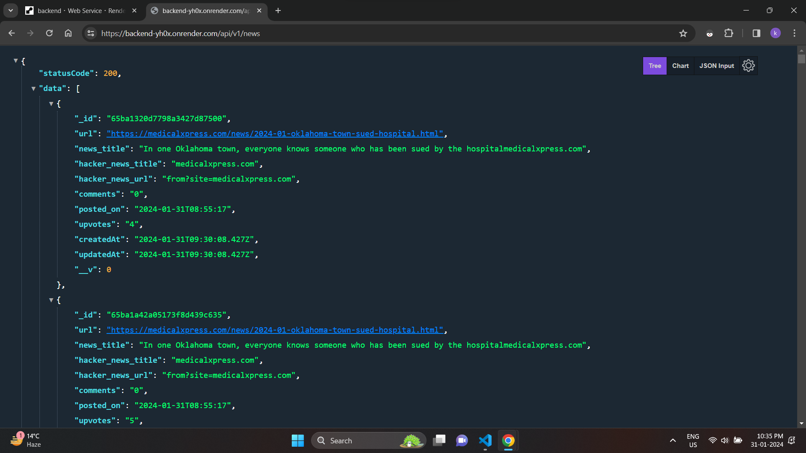

## RED BATON ASSIGNMENT

### tech stack used
1. MERN Stack
2. TailwindCSS
3. Cron-Schedule
4. Cheerio

### description
This project harnesh the potential of cheerio to scrap website's data in node environment.

And with the help of Cron-Schedule we can shedule the crawling of data. which will be further either updated in database or inserted if new.

Backend will return the data in reverse chronological order.

## Backend Data
